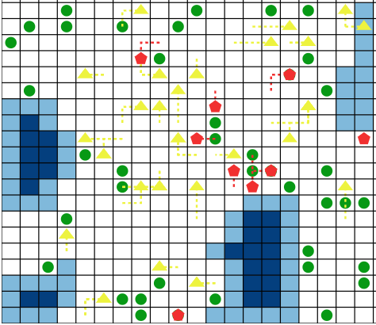

# RL Nature  🌍 🐆🐘

This repository implements an advanced multi-agent reinforcement learning framework that simulates predator-prey dynamics in a customizable grid world environment. Using `ray[rllib]`, we model complex ecological interactions across multiple trophic levels. The simulation features realistic energy dynamics, resource consumption, and reproduction mechanics. Unlike previous work that often uses a single, centralized network, we train allow species to model the world using their own network. Our modular design allows researchers to easily configure environmental parameters, species attributes, and observation capabilities and extend our work. Have fun!

<p align="center">
  
</p>


## Environment Setup

To work with this codebase, please set up a conda environment the following way

```bash
conda env create -f env.yml
conda activate marl
```

## Environment Configuration

All configuration files are stored in the `config` folder. We provide several example config files that can be used for training. Please feel free to change any of the parameters and see how the change animal behavior!

## Training

We use `rllib` to train our species-level models. Please see file `models/default.py` for the exact model parameters and definition. Note that every species will have its own copy of the model.

The simplest way to get started is to go start training! To do so run the following line from `.`

```bash
python train.py --config NAME
```

Note several things:

- `NAME` refers to the config name you want to run, _not_ the path to that config.
- Executing this run command will create a `ckpt` folder if it doesn't exist.
- The specific run names can be specified via the config. Currently the training code generates a run name in the format `CURRENTTIME_NAME`.
- The model weights are saved in a folder `ckpt/CURRENTTIME_NAME/` that is created by `rllib`.

## Evaluation

After you have trained a model (or using some of the checkpoints we provide), you can roll out an evaluation run and see how your trained animals behave. To do so run the following line.

```bash
python eval.py -p ckpt/174666872807888_3sp_w07
```

Note several things:

- This will create a `results` folder if it doesn't exist.
- Generate a subfolder with the same name as your checkpoint.
- Output results are saved as `JSON` files. Each roll out gets assigned a random number which is part of its results name. We provide one or two examples in the repo. It should look something like this: `results/CURRENTTIME_NAME/results_24142.json`.

## Visualization

We provide a visualizer that lets you see what each animal is doing in each step! Use it! To do so run the following command.

```bash
python render_trial.py -j results/example/results_0000.json
```

Note:

- This creates a html file called `plot.html` that gets saved to `results/CURRENTTIME_NAME/`.
- If you run this command on several `json` files of the same checkpoint, you will overwrite previous `plot.html` files. We do this as often the visualization is useful for debugging and not needed to keep around.

The visualizer should produce plots such as this one saved in `./results/example/plot.html`

## Model

Our agent learning framework is built on top of rllib and PyTorch. Our agents perceive the world through a dual-input stream: grid observations through convolutional layers and agent state variables through dedicated embedding layers. These state variables track critical survival parameters including energy levels, thirst, hunger, reproductive timing, and energy reserves for reproduction. The processed inputs are combined and passed through fully connected layers before splitting into separate policy and value function heads. This architecture enables our agents to develop sophisticated behaviors.
